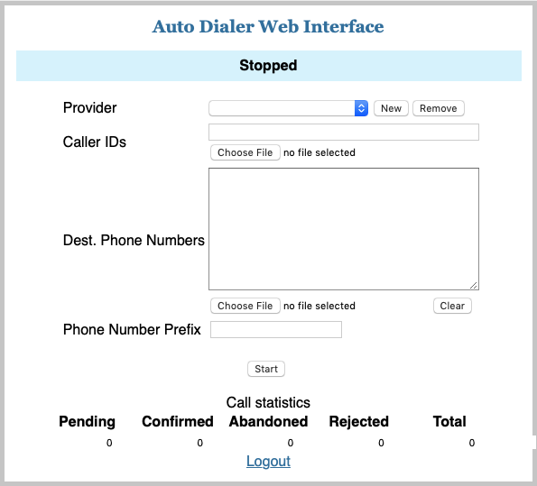

# Features

- Login screen (default credentials are admin/secret)

- Multiple providers can be created (only one active provider can be used when dialing)

- Caller IDs can be specified as either a list with comma separated values or loaded from a file (one caller ID per line). This features requires separate caller ID feature to be enabled in PJSIP library. If the number of caller IDs is smaller than the number of destination numbers caller IDs will be reused.

- Destination phone numbers can be specified in the edit box or loaded from a file (one destination number per line)

- Optionally a phone number prefix can be specified to be added to each destination number before dialing

- Call statistics are generated and saved into a CSV file that can be downloaded

- Once a call is answered the audio is recorded for each call into an amr file (sox is needed) then transcribed to text using Google Text To Speech API (you need to provide Google API credentials in a JSON file). The audio files and the transcription can be found in <root>/static/download. If Google API credentials are not provided the transcription file is not generated.

# Running the application from Docker

- install Docker from https://www.docker.com

- from a terminal, download the Docker image

    docker pull cristeab/ubuntu_autodialer

- start the application with

    docker run -d -p 8000:8000 cristeab/ubuntu_autodialer /start_autodialer.sh

- connect the autodialer UI with your web browser using as address

    http://localhost:8000

- in order to verify the application status use

    docker ps

- in order to stop the application use

    docker stop <image name>

where <image name> is the string shown in column 'NAMES' by 'docker ps'

- transfer all session files from Docker image to your host with

    docker cp <image name>:/web_autodialer/static/download/ <dest folder>

Note: By default the Docker image does not contain a service account key file. You need to copy one into
Docker image following the install instructions and using the commands
    docker cp <service account key file> <image name>:/web_autodialer/
    docker run -it -p 8000:8000 cristeab/ubuntu_autodialer bash

# Install instructions

- Important note: currently only Python 2 is supported.

- install PJSIP library with Python bindings on Linux
   * download PJSIP library sources from http://www.pjsip.org
   * unzip the sources into some folder and enter into that folder
   * configure the sources with
     ./configure --enable-shared --disable-libyuv --disable-libwebrtc
   * create the config_site.h file
     cp pjlib/include/pj/config_site_sample.h pjlib/include/pj/config_site.h
   * compile and install PJSIP library
     make dep && make
     sudo make install
   * compile and install Python bindings
     cd pjsip-apps/src/python
     make
     sudo make install

- install flask

    pip install flask flask-socketio eventlet

- install Google Cloud Speech API for Python (see https://github.com/GoogleCloudPlatform/python-docs-samples/tree/master/speech/cloud-client)
    pip install -r requirements.txt

- in order to authenticate with Google Cloud Speech API you need to create a service account key file:

    https://developers.google.com/identity/protocols/application-default-credentials

Once the JSON service account file is created put it next to 'websoftphone.py' and make sure that in
'websoftphone.py' app.config['GOOGLE_API_CREDENTIALS'] points to the correct location.

# Instructions for starting the web softphone on Linux

- change current folder to 'websoftphone' folder

   cd websoftphone

- start the web softphone with

   nohup ./websoftphone.py &

then use a web browser to connect to 'http://<server address>:8000'. The first page is the login page. In order
to login use 'admin' and 'secret', then press 'Login' button.

Note: if an error occurs when the application is started, you might need to stop the already launched application with

   killall python

# Utilisation instructions

- both, caller IDs file and destination phone numbers files, must have on each line a single call ID and
destination number respectively

- once all calls are finished, calls statistics are saved into a csv file together with the recording of each call
(into a wav file) as well as the corresponding text transcription (into a txt file). All these files are saved into a folder
'static/download/<current date and time>-<provider ID>' whose name contains the current date and time

- log messages can be generated either into a file, 'websoftphone.log', or send to syslog (default, must be used when
multiple instances are started). The variable that controls where the messages are send is 'log_to_file'.
In order to view the messages send to syslog, on openSUSE, one can use

    sudo tail -f /var/log/messages | grep WebAutoDialer

Recent Linux distributions use instead journalctl

    journalctl -f | grep WebAutoDialer

- in order to start multiple instances of the same application use the provided script './websoftphone.sh'.
For example, in order to start 2 instances use:

    ./websoftphone.sh start 2

Then connect to each of these instances with 'http://<IP address>:8000' and 'http://<IP address>:8001',
respectively. In order to stop all instances use

    ./websoftphone.sh stop

I order to show all running instances use

    ./websoftphone.sh show

# Transcribe separately the recorded audio files

- use

   ./transcribe_folder.py \<path>

where \<path> is the path to the folder where the audio files reside (wav or amr).